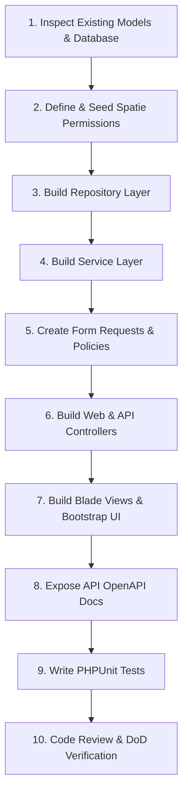

# Module Development Workflow

Every module built for the Antigravity HR Portal must follow these 10 logical steps to ensure consistency and pass automated code reviews.

---

## 🗺️ Step-by-Step Flow

---

### Step 1: Inspect Models & DB
- Check [app/Models/](file:///d:/SOFTWARES/xampp82new/hri2k2new/laravel_files/app/Models/) to see columns, attribute casting, and pre-existing relationships.
- Identify all tables, constraints, and index details.

### Step 2: Seed Permissions & Roles
- Define permissions (e.g. `leaves.create`, `leaves.approve`).
- Update `PermissionSeeder.php` and `RoleSeeder.php` files.
- Apply seeders dynamically: `php artisan db:seed --class=PermissionSeeder`.

### Step 3: Write Repository Layer
- Create `EmployeeRepository.php` to handle all queries, filters, and paginate constraints.
- Implement eager loading of linked tables.

### Step 4: Write Service Layer
- Create `EmployeeService.php` to handle business logic, events, and transactional operations.

### Step 5: Secure Requests & Policies
- Define validation arrays in dedicated Form Request files.
- Write Policies to enforce ownership validation (e.g., employees can edit only their own contact info).

### Step 6: Create Web & API Controllers
- Load services in constructors.
- Keep methods simple, mapping data directly to Blade views or JSON API Resources.

### Step 7: Create Views & Blade UI
- Setup Blade templates using standard local Bootstrap components and jQuery widgets (like DataTables).
- Add custom JS elements in stacked scripts to keep logic modular.

### Step 8: Build API OpenAPI Swagger Docs
- Add annotations in API controllers.
- Build specifications: `php artisan l5-swagger:generate`.

### Step 9: Write PHPUnit Tests
- Write feature, validation, permission, and API tests checking response status and structures.

### Step 10: Complete Definition of Done
- Go through the DoD checklist, verify query counts (no N+1 issues), and request architect approval.
