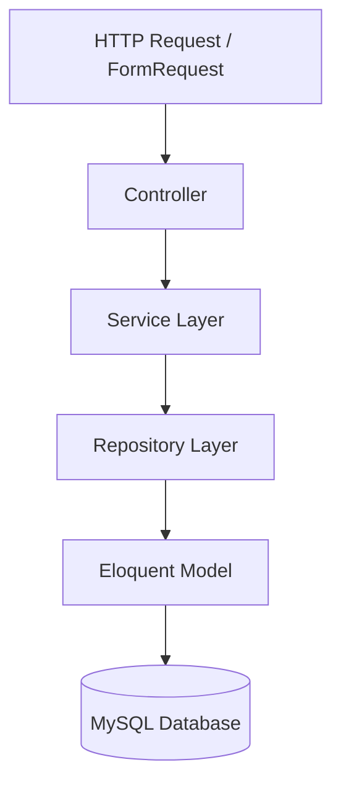

# Project Overview: Antigravity HR Portal

This document provides a high-level overview of the target project, detailing the tech stack, structural patterns, authentication, and authorization integrations.

---

## 🛠️ Technology Stack

| Layer | Technology | Specification / Notes |
| :--- | :--- | :--- |
| **Backend Framework** | Laravel 12 | Enterprise-level structured setup |
| **Language** | PHP 8.3+ | Explicit return typing, strict types enabled |
| **Frontend Framework**| Bootstrap 5.3 | Custom light/dark themes, responsive grid |
| **Database** | MySQL | Reusing existing database `i2u2_db_laravel` |
| **Authentication** | Laravel Breeze | Fully integrated into web views & Sanctum tokens |
| **Authorization** | Spatie Permission | Dynamic role/permission validation |
| **Local Libraries** | jQuery, DataTables, etc. | Stored in `public/assets/vendor/` |

---

## 🏛️ Architectural Patterns

The portal follows a strict **Controller-Service-Repository** boundary pattern:

### 1. Controllers
- Handle request routing and HTTP response generation.
- Never contain SQL queries or business logic.
- Utilize Laravel Form Requests for input validation.
- Return Laravel API Resources for API responses, and Blade templates for web requests.

### 2. Service Layer
- Handles all business rules, calculations, transaction control, event dispatching, and notification triggers.
- Isolated from specific HTTP request details (can be used in console commands, jobs, or web controllers).

### 3. Repository Layer
- Handles all database querying and data persistence.
- Shields the service layer from direct Eloquent dependency (enabling easier caching and query optimizations).

---

## ⚙️ Authentication & Authorization

### 1. Web & API Auth
- **Web Portal**: standard session authentication using Laravel Breeze.
- **REST API**: token-based security using Laravel Sanctum.

### 2. Spatie Permission Integration
- Every action must be guarded by a permission (e.g. `employees.create`, `leaves.approve`).
- Roles (e.g. `Super Admin`, `HR Manager`, `Employee`) map to groups of permissions.
- When an AI agent builds a module, it must automatically create corresponding permissions, update the `PermissionSeeder`, and update the `RoleSeeder`.

---

## 📊 Database Reuse Guidelines

> [!IMPORTANT]
> The database tables and Laravel models already exist.
> - **DO NOT** write or run migrations that recreate or modify tables unless explicitly requested.
> - **DO NOT** edit existing columns without evaluating impacts on past data.
> - Utilize relationships already defined inside [app/Models/](file:///d:/SOFTWARES/xampp82new/hri2k2new/laravel_files/app/Models/).
